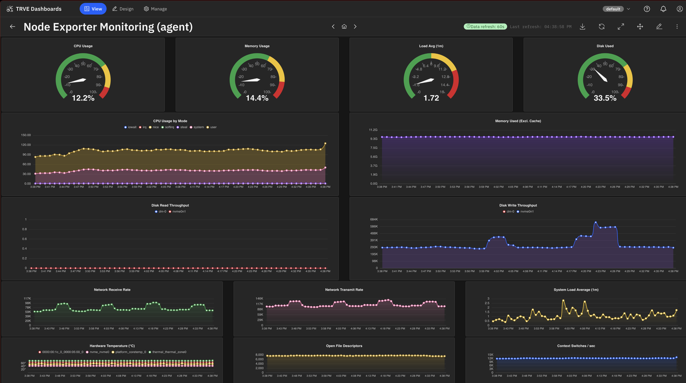

# Example: an AI-built Prometheus monitoring dashboard

A complete, working node-exporter monitoring dashboard built end-to-end
from a single natural-language prompt — no grid math, PromQL, or chart-type
hints supplied. The model discovers the data shape, creates the chart
components, and assembles them into a laid-out dashboard.

## How it was built

TRV Outpost exposes AI-assisted dashboard building two ways, both
driving the same component/dashboard tools:

- **Dashboard Assistant** — the in-app chat sidecar. Ask it (e.g. *"Build
  a node-exporter monitoring dashboard on my Prometheus connection — at
  least 12 charts filling the canvas, each with a concise title"*) and it
  probes the connection, plans the layout, creates the components, and
  assembles the dashboard.
- **MCP** — external agents (Claude Code, Claude Desktop via `mcp-proxy`)
  connect to the server's MCP endpoint and use the `dashboard-builder`
  prompt + the same tool surface. See [docs/mcp.md](../../docs/mcp.md).

The dashboard above was produced from a ~65-word brief like:

> Build a node-exporter monitoring dashboard on the Prometheus connection.
> Show at least 12 charts filling the canvas; more are fine if the layout
> stays readable and there's additional node-exporter data worth
> surfacing. Give each chart a concise title.

## What the model does

1. Discovers the connection's data shape (metrics + labels) — it does not
   guess column names.
2. Plans the dashboard: how many panels, which chart types, the grid
   layout within the canvas's cell budget.
3. Creates one component per chart (charts render from saved config; the
   canonical types need no hand-written code).
4. Assembles a dashboard whose panels reference those components, packed to
   fill the canvas without overlaps or gaps.

The result is a real, refreshing dashboard against live data — the same
artifact a human would build through Design mode, produced from a sentence.

> Historical note: an earlier standalone `dashboard-agent` CLI (an external
> MCP client) was the first cut at this and has since been retired — the
> in-app Assistant supersedes it. The screenshot here is one of its runs;
> the Assistant and MCP build equivalent dashboards today.
