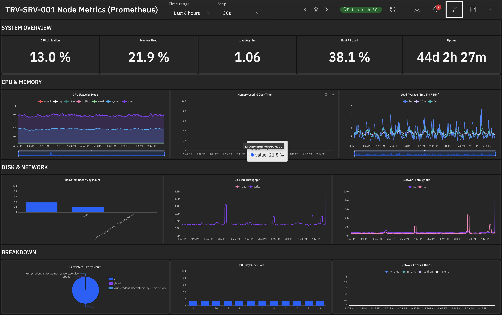
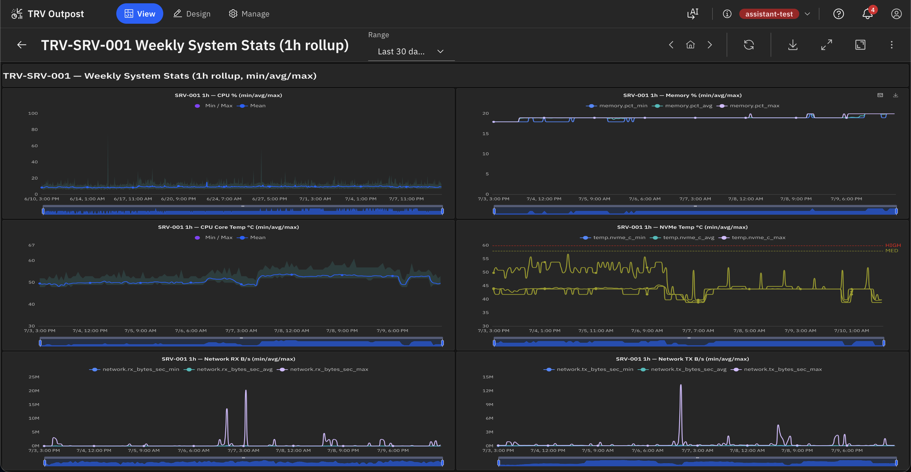
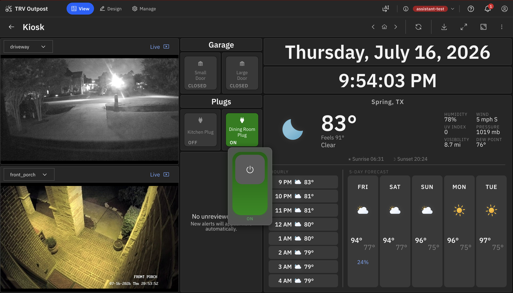
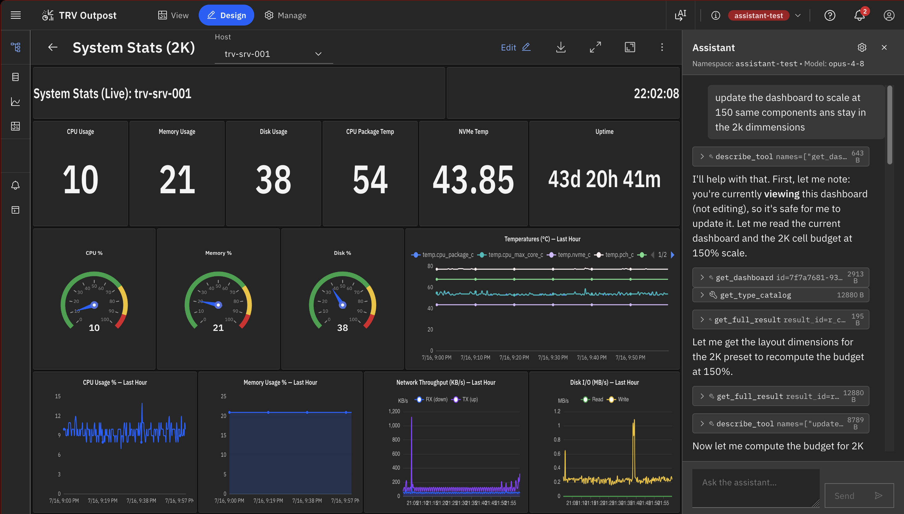
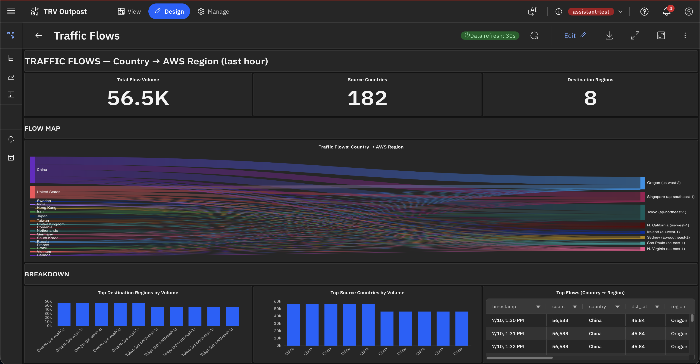

# Example dashboards

Real dashboards running against live data — some assembled by hand in
Design mode, some built end-to-end by the AI from a single prompt. Each
section says which.

| Dashboard | What it shows |
| --------- | ------------- |
| [Prometheus node metrics](#ai-built-prometheus-node-metrics) | A 12+ panel monitoring dashboard built end-to-end from one natural-language brief |
| [System stats — ts-store rollups](#system-stats--ts-store-rollups) | Rollup stores rendered as min/avg/max bands, scoped by a range variable |
| [Kitchen kiosk](#kitchen-kiosk) | Live cameras, controls, and weather on a single always-on screen |
| [Assistant editing a live dashboard](#assistant-editing-a-live-dashboard) | The in-app agent mid-task, with its tool calls visible |
| [Traffic flows (Sankey)](#ai-built-traffic-flows-sankey) | An AI-built Sankey over country → region flow data |

---

## AI-built Prometheus node metrics

A complete, working node-exporter monitoring dashboard built end-to-end
from a single natural-language prompt — no grid math, PromQL, or chart-type
hints supplied. The model discovers the data shape, creates the chart
components, and assembles them into a laid-out dashboard.

The header's **Time range** and **Step** pickers are a range dashboard
variable: the range scopes every panel at once, and the step sets the
resolution Prometheus downsamples to.

### How it was built

TRV Outpost exposes AI-assisted dashboard building two ways, both
driving the same component/dashboard tools:

- **Dashboard Assistant** — the in-app chat sidecar. Ask it (e.g. *"Build
  a node-exporter monitoring dashboard on my Prometheus connection — at
  least 12 charts filling the canvas, each with a concise title"*) and it
  probes the connection, plans the layout, creates the components, and
  assembles the dashboard.
- **MCP** — external agents (Claude Code, Claude Desktop via `mcp-proxy`)
  connect to the server's MCP endpoint and use the `dashboard-builder`
  prompt + the same tool surface. See [docs/mcp.md](../../docs/mcp.md).

The dashboard above was produced from a ~65-word brief like:

> Build a node-exporter monitoring dashboard on the Prometheus connection.
> Show at least 12 charts filling the canvas; more are fine if the layout
> stays readable and there's additional node-exporter data worth
> surfacing. Give each chart a concise title.

### What the model does

1. Discovers the connection's data shape (metrics + labels) — it does not
   guess column names.
2. Plans the dashboard: how many panels, which chart types, the grid
   layout within the canvas's cell budget.
3. Creates one component per chart (charts render from saved config; the
   canonical types need no hand-written code).
4. Assembles a dashboard whose panels reference those components, packed to
   fill the canvas without overlaps or gaps.

The result is a real, refreshing dashboard against live data — the same
artifact a human would build through Design mode, produced from a sentence.

---

## System stats — ts-store rollups

A week of host metrics read from ts-store **rollup stores** — the 1h
`min`/`avg`/`max` aggregates ts-store maintains alongside the raw source
store, so a long window stays cheap to query.

CPU and core temperature render as min/max bands around the mean; memory,
NVMe temperature, and network throughput plot the three series directly.
The NVMe panel carries `MED`/`HIGH` threshold lines. The header's **Range**
picker (*Last 30 days*) scopes every panel at once, and each chart keeps a
data-zoom brush for narrowing in without re-querying.

---

## Kitchen kiosk

An always-on wall display, showing that a dashboard isn't only charts —
this one has **no chart components at all**.

Two live Frigate camera feeds (driveway, front porch) sit next to garage
door contact sensors and smart-plug controls. The open plug popup is a
control mid-interaction: tiles show live state, and tapping one sends the
command back through the connection. A Frigate alerts panel fills with
unreviewed events as they arrive. The weather panel carries current
conditions, an hourly strip, and a 5-day forecast.

---

## Assistant editing a live dashboard

The in-app **Assistant** working on the dashboard next to it — here asked
to rescale the board to 150% while staying inside the 2K canvas.

The transcript shows the agent's actual tool calls (`get_dashboard`,
`get_type_catalog`, `describe_tool`) rather than hiding them, so you can
see what it read before it wrote. It also notices the dashboard is being
*viewed* rather than *edited* and says so before changing anything. The
panel reports the active namespace and model.

The dashboard behind it mixes number tiles, gauges, and time-series charts
over a live host-metrics feed, with a **Host** variable in the header to
repoint every panel at a different machine.

---

## AI-built traffic flows (Sankey)

An Assistant-built dashboard over network flow data, led by a **Sankey**
linking 182 source countries to 8 destination AWS regions.

Sankey is one of the canonical chart types, so it renders from saved config
with no hand-written component code — the agent picked the type, mapped
source/target/value, and laid the board out. Stat tiles summarize the
window; bar charts rank top regions and source countries; a data table
carries the underlying rows. Panels refresh on a 30s interval.
